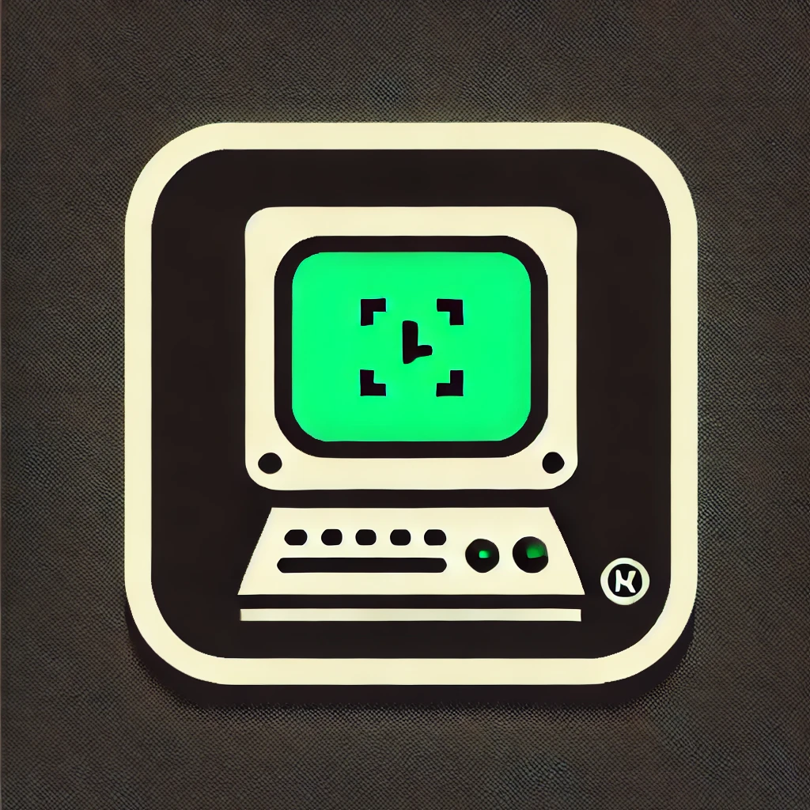

{ width="300" .center }
# Terminal Based Games Builder

This repository hosts a tool that builds code for terminal-based games. Just tell the code which game you want to build, and it will create the game for you! Perfect for quickly creating classic or custom games with minimal effort. Contributions are welcome!

# Welcome to MkDocs

For full documentation visit [mkdocs.org](https://www.mkdocs.org).

## Commands

* `mkdocs new [dir-name]` - Create a new project.
* `mkdocs serve` - Start the live-reloading docs server.
* `mkdocs build` - Build the documentation site.
* `mkdocs -h` - Print help message and exit.

## Project layout

    mkdocs.yml    # The configuration file.
    docs/
        index.md  # The documentation homepage.
        ...       # Other markdown pages, images and other files.
